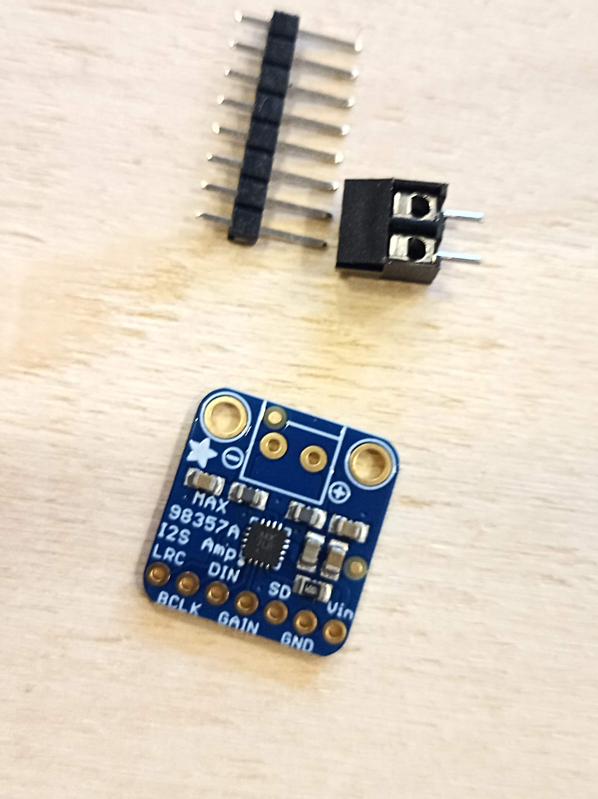

# Assemblage de la boite à histoire

Matériel nécessaire :

- fer à souder
- soudure
- pince à dénuder
- pince coupante
- des ciseaux
- du scotch de peintre

On commence par les composants passifs (diodes et résistances)

Plier les pates de résistances et des diodes :

Placer la diode et les résistances sur le circuit imprimé (PCB). On peut plier les pates pour que les composants ne bougent pas.

Souder les pates :

On passe au lecteur de cartes SD : 

Découper la barette de pins à la bonne longueur :

Assembler le lecteur de carte et la barette. Placer le tout sur le circuit imprimé.

Attention à garder le lecteur de carte SD bien droit, bien parallèle au circuit imprimé. On peut s'aider d'une ptite calle avant de souder.

Souder les broches côté lecteur de carte SD et ensuite à l'arrière du circuit imprimé

On continue avec la carte son, couper les broches nécessaires :
- 1x 7 broches
- 2x 1 broche

Ensuite mettre les broches à l'arrière de la carte ampli et insérer le tout sur le PCB

Un morcau de scotch permet de maintenir la carte avant de la souder :

On continue avec le chargeur, il faut couper 2x 2 pins et 2x 1 pin, tout mettre sur la PCB et ensuite positionner le chargeur sur les pins et souder le tout. 

Veillez a bien garder le chargeur parallèlle au PCB

Un sctoch est de nouveau bien pratique pour maintenir le tout.

Prendre la pico et enfoncer le "header" sur ses broches :

Placer la carte pico avec ces header et souder les broches

Encore une fois, le scotch permet de tout bien maintenir :-)

Souder chaque broche en faisant attention à ne pas créer de pont entre deux soudures

On passe aux switches, soit souder le switches directement sur la pcb, soit souder des fils de cablage pour avoir des switchs déportés sur le boitier

Exemple ici avec les switch soudés à l'arrière de la PCB. La carte sera vissée directement au boitier afin que les switches soient visibles.

Souder le potentiomètre directement sur la PCB

Terminer par souder du fil de cablage sur les pads "switch", "speaker", en s'aidant d'un scotch

Et voilà, tout est soudé :

